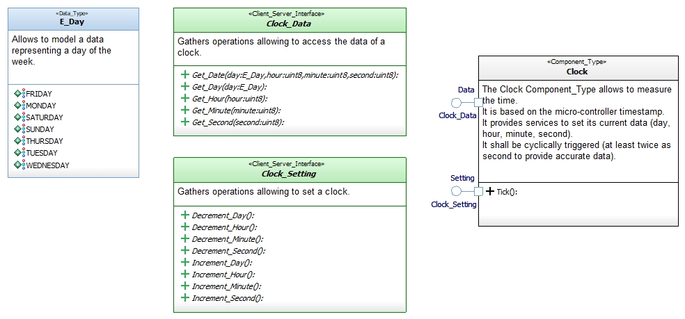

# Clock

This repository defines software elements allowing to measure time on an embedded software.

Modeled using the [Software_Model_Toolset](https://github.com/HomeMadeRobots/Software_Model_Toolset).

Implemented using the [Embedded_C_Framework](https://github.com/HomeMadeRobots/Embedded_C_Framework).

## Description

The Clock Component_Type allows to measure the time.

It is based on the micro-controller timestamp.

It provides services to set its current data (day, hour, minute, second).

It shall be cyclically triggered (at least twice as second to provide accurate data).

## Needed repositories

This repo use the following repositories :
- [Embedded_C_Framework](https://github.com/HomeMadeRobots/Embedded_C_Framework) (*Timestamp.h*)

## Physical software architecture

## Internal design

See [wiki](https://github.com/HomeMadeRobots/Clock/wiki/Clock-internal-design).
